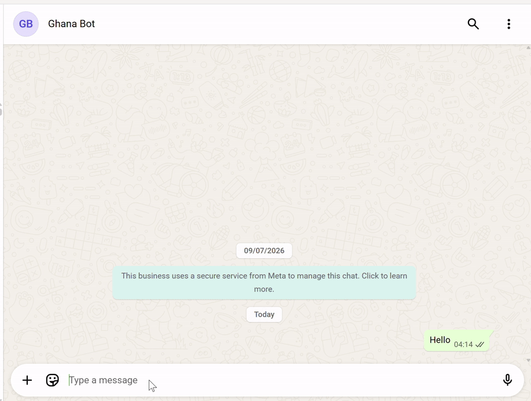
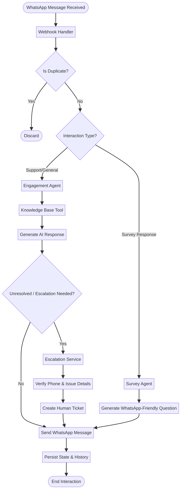
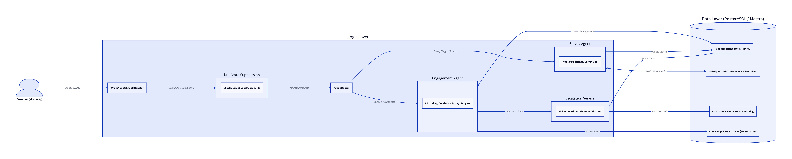

# FBNBank Ghana/Senegal WhatsApp Intelligence Platform

<p align="center">
  <a href="https://drive.google.com/file/d/1Pm5VX9laf0NBxFQMu83chD8AjeYGXh3B/view?usp=sharing" target="_blank" rel="noopener noreferrer">
    
  </a>
</p>

<p align="center">
  <strong>Click the preview above to watch the full demo video.</strong>
</p>

A production-minded WhatsApp customer engagement and survey automation system for FBNBank Ghana/Senegal, built with Mastra, TypeScript, PostgreSQL, and the Meta WhatsApp Business API.

This project is a strong example of applied AI in a regulated enterprise environment: it combines agentic conversation, retrieval-augmented generation, multilingual support, workflow automation, and human escalation into one coherent customer service solution.

---

## Executive summary

This repository demonstrates the design and implementation of an AI-powered WhatsApp support platform for a banking context. Rather than treating the chatbot as a standalone conversational toy, the system is built as a reliable operational layer that can:

- answer routine customer questions quickly,
- ground responses in verified knowledge,
- support multilingual interactions in English and French,
- collect structured feedback through interactive surveys,
- escalate unresolved or sensitive issues to human support.

The result is a practical, production-style assistant that improves response quality, reduces repetitive support load, and creates a safer path for complex customer issues.

---

## Why this project stands out

What makes this project impressive is the combination of architecture choices and real-world business intent:

- It is not just a chatbot; it is an orchestration layer for messaging operations.
- It uses retrieval instead of relying only on model memory, which makes answers more grounded.
- It separates conversation logic, workflow logic, and external integrations cleanly.
- It incorporates human-in-the-loop escalation for high-stakes banking scenarios.
- It shows direct enterprise readiness through PostgreSQL persistence, webhook processing, and API-driven deployment patterns.

For interviewers or hiring teams, this is the kind of project that signals system design maturity, practical AI implementation, and strong engineering discipline.

---

## Business problem being solved

Banks often receive a very high volume of repetitive customer queries across channels such as WhatsApp, SMS, email, and social messaging. Many of these requests are simple and repeatable:

- account product questions,
- service availability,
- branch and contact information,
- general banking procedure queries,
- satisfaction surveys and feedback collection.

The challenge is to automate these interactions without losing accuracy, tone, or compliance. This project addresses that gap by building an AI-assisted customer support system that can handle the high-frequency front line while still escalating complex or sensitive cases to a human agent.

---

## System overview

The platform is organized into five main layers:

1. Messaging layer
   - WhatsApp Business API and Meta webhook handling
2. Agent layer
   - LLM-powered customer engagement and survey generation agents
3. Tool layer
   - knowledge search, message sending, template sending, and escalation tools
4. Workflow layer
   - multi-step orchestration for survey execution and business processes
5. Persistence layer
   - PostgreSQL-backed session, survey, and escalation storage

This layered approach keeps the application maintainable and makes it easy to reason about where each responsibility lives.

---

## Architecture diagram 1

The first architecture diagram shows the end-to-end runtime path of a customer interaction.



### What the diagram means

This image captures the operational flow of the bot in production terms:

1. A customer initiates contact through WhatsApp.
2. Meta sends the incoming event to the webhook endpoint exposed by the application.
3. The webhook route validates and forwards the payload into the Mastra runtime.
4. The engagement agent interprets the request, detects language, and identifies customer intent.
5. The system may call the knowledge-base search tool to retrieve grounded documentation before replying.
6. If the issue is resolved through automated guidance, the bot replies on WhatsApp.
7. If the case requires a human touch, the escalation tool logs a ticket and preserves the conversation context.
8. Survey workflows can also run in parallel to gather structured customer feedback.

This is the most important architectural story in the project: the system is built as a coordinated AI service, not as a single prompt-driven script.

---

## Architecture diagram 2

The second architecture diagram explains the implementation structure inside the repository.



### What the diagram means

This view shows how the codebase is organized into clear engineering modules:

- `src/mastra/index.ts` boots the application and registers the routes.
- `agents/` contains the conversational intelligence components.
  - `engagement-agent.ts` manages multilingual customer support, menu-driven guidance, knowledge retrieval, and escalation.
  - `survey-agent.ts` generates survey question structures that are compatible with WhatsApp interactive messages.
- `workflows/` contains the orchestration layer.
  - `survey-workflow.ts` drives the full survey lifecycle from generation to delivery to response capture.
  - `weather-workflow.ts` acts as a lightweight example workflow showing the framework’s broader workflow model.
- `tools/` contains the actions the agents can invoke.
  - message sending,
  - template sending,
  - RAG-based knowledge retrieval,
  - human handoff and ticket creation.
- `core/` handles shared infrastructure concerns such as the LLM provider and Postgres-backed runtime storage.
- `metaWebhook.ts` and `metaFlowApi.ts` handle Meta/WhatsApp integration and webhook validation.

This decomposition is exactly what makes the application scalable and understandable to a technical reviewer.

---

## Core technical components

### 1. Customer engagement agent

The engagement agent is the heart of the customer interaction layer. It is responsible for:

- greeting users and presenting a topic menu,
- understanding customer intent,
- switching between French and English when needed,
- retrieving factual guidance using a knowledge-base tool,
- escalating unresolved or sensitive cases to a human representative.

A key design strength is that the agent is not allowed to answer banking questions purely from memory. It first searches the knowledge base, which grounds the response and reduces the likelihood of unsupported claims.

### 2. Survey-generation agent

The survey agent is designed specifically for structured, mobile-friendly feedback collection. It produces survey questions that fit WhatsApp’s interaction model and respects constraints such as:

- interactive button limits,
- list structure requirements,
- conditional follow-up logic,
- safe and non-sensitive question design.

This makes the bot capable not just of support, but also of user research and feedback orchestration.

### 3. Survey workflow

The survey workflow is the execution engine behind the feedback collection system. It can:

- generate survey questions from a topic,
- load manual surveys from storage,
- send questions sequentially to a customer,
- persist survey session state,
- gather and review responses through admin endpoints.

This proves the project can handle more than one-off message automation; it can manage structured business workflows.

### 4. Retrieval-augmented knowledge layer

The knowledge-base tool performs document search using the retrieval pipeline, allowing the bot to answer with grounded context rather than hallucinating from general model knowledge.

In a banking context, that is a major reliability improvement because it keeps responses anchored to the organization’s documented procedures and policies.

### 5. Escalation and ticketing path

The human escalation tool allows the system to move unresolved customer issues into an operational support process. This is important because it preserves customer context and creates a real handoff path for complaints, complex requests, or cases requiring a representative.

This feature is one of the strongest indications that the project is designed for real enterprise usage rather than a simple prototype.

### 6. Postgres-backed shared storage

The shared Postgres store supports the memory, session, and workflow state for the whole application. This matters because the bot is not merely a single-agent instance; it is a multi-component agentic system that needs stable state management.

### 7. LLM provider abstraction

The provider module consolidates model access for OpenAI and Azure OpenAI and also handles the embedding warm-up process for retrieval. This makes the codebase more portable and better prepared for production deployment changes.

---

## Project structure

The codebase is organized with a very practical engineering layout:

- `src/mastra/index.ts` — bootstrap and route registration
- `src/mastra/metaWebhook.ts` — Meta webhook validation and incoming message handling
- `src/mastra/metaFlowApi.ts` — flow management and Meta-specific integrations
- `src/mastra/sendMetaTemplate.ts` — WhatsApp template send helper
- `src/mastra/agents/engagement-agent.ts` — customer service agent
- `src/mastra/agents/survey-agent.ts` — survey generation agent
- `src/mastra/workflows/survey-workflow.ts` — survey orchestration workflow
- `src/mastra/tools/knowledge-base-tool.ts` — retrieval tool
- `src/mastra/tools/escalate-to-human.ts` — human handoff logic
- `src/mastra/tools/send-whatsapp-message-tool.ts` — outbound WhatsApp delivery
- `src/mastra/tools/send-whatsapp-survey-tool.ts` — survey delivery utilities
- `src/mastra/core/db/shared-pg-store.ts` — shared database persistence layer
- `src/mastra/core/llm/provider.ts` — provider abstraction for AI model access

---

## Runtime workflow

A typical interaction in the application follows this pattern:

1. Customer sends a message on WhatsApp.
2. The Meta webhook receives it.
3. The engagement agent interprets the intent and language.
4. The agent optionally uses RAG retrieval for factual grounding.
5. A response is composed in a mobile-friendly format.
6. If the request cannot be resolved or needs a human touch, the escalation workflow kicks in.
7. If the request is survey-oriented, the survey workflow manages the sequence and stores the results.

This demonstrates clear control flow, sensible separation of concerns, and a realistic production lifecycle.

---

## Demo

A short walk-through video of the bot in use is available here:

https://drive.google.com/file/d/1Pm5VX9laf0NBxFQMu83chD8AjeYGXh3B/view?usp=sharing

The demo is valuable because it shows the bot in a real customer-facing interaction, not just as static architecture artifacts.

---

## Tech stack

- Mastra
- TypeScript
- Node.js
- PostgreSQL
- Meta WhatsApp Business API
- OpenAI / Azure OpenAI
- FastEmbed-based retrieval integration
- REST-style API route registration for operational endpoints

---

## Getting started

### Requirements

- Node.js 22+
- pnpm
- PostgreSQL instance with `DATABASE_URL`
- Meta WhatsApp Business API credentials
- OpenAI or Azure OpenAI access

### Install

```bash
pnpm install
```

### Run locally

```bash
pnpm run dev
```

### Start on a custom port

```bash
pnpm run start:port
```

### Build

```bash
pnpm run build
```

---

## Environment configuration

The project uses environment values such as:

- `DATABASE_URL`
- `WHATSAPP_BUSINESS_PHONE_NUMBER_ID`
- `WHATSAPP_BUSINESS_ACCOUNT_ID`
- `WHATSAPP_ACCESS_TOKEN`
- `VERIFY_TOKEN`
- `AZURE_OPENAI_API_KEY`
- `AZURE_OPENAI_API_VERSION`
- `AZURE_RESOURCE_NAME`
- `AZURE_OPENAI_DEPLOYMENT`
- `OPENAI_MODEL`

These variables support storage, webhook verification, outbound delivery, and model orchestration.

---


## Summary

The FBNBank Ghana/Senegal WhatsApp Intelligence Platform is a practical, polished example of enterprise AI product engineering. It combines messaging automation, conversational intelligence, knowledge retrieval, and human escalation into a single customer-support workflow.
---

## License

Repository usage is governed by the project’s current deployment and repository policy. If needed, confirm licensing terms with the repository owner or maintainers.

## Contact

For technical review, collaboration, or project discussion, feel free to reach out at:

- Email: [lawal.alx@gmail.com](mailto:lawal.alx@gmail.com)
